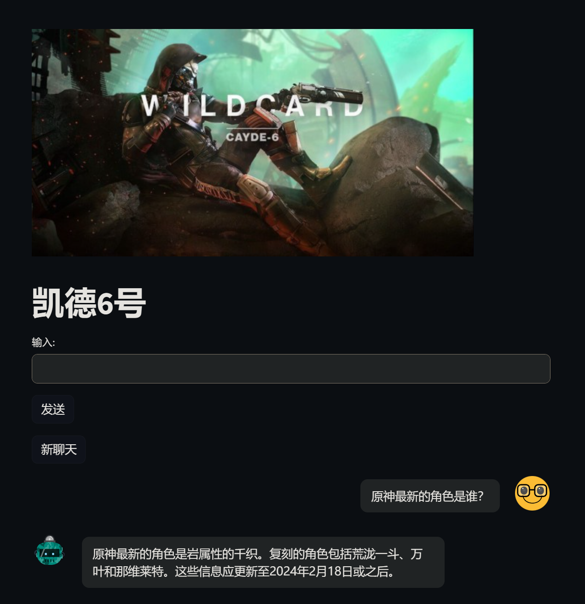
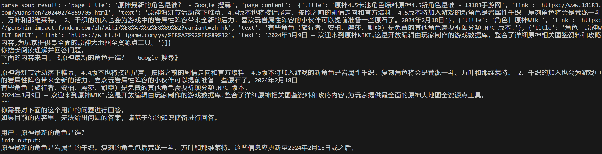

最新闲来无事，用streamlit手撸了一个本地的聊天大模型，支持网页搜索。

先放一张效果图：

从日志可以看到是有先搜索再请求大模型：

感觉还挺有意思，后续会持续优化一下，不知道能不能做到perplexity的水平。

目前主要在考虑的优化方向：

- 联系上下文的prompts
- 模型调整：目前是千文的 14b-q8，考虑到上下文的处理，可能会使输入token变得非常大
- 模型自动分析搜索结果及优化搜索query（有点难）
